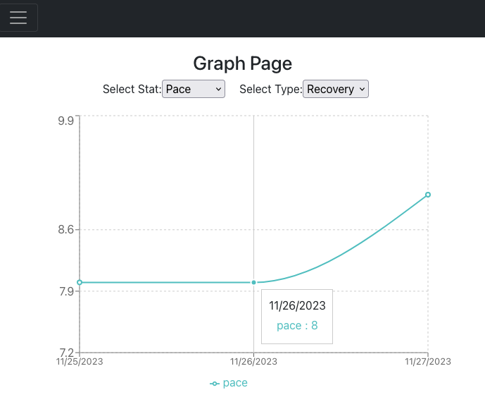

[Interact with the hosted app here](https://runningstatsdashboard.web.app/).

This is an app that provides a user with visualizations of different metrics from their runs over time. These include pace, effort, and distance. The user can also filter for different types of runs, including easy, recover, tempo, long, and all runs. This is because most metrics don’t make sense to be compared across different types of runs. For example, during a recovery run a person is purposefully running at a slower pace, whereas during a tempo run they are running at a much faster pace. 

There are two main pages to the app: The “Log Run” page allows a user to input a run. They must enter the date, time, distance, duration, pace, type, and effort. This is stored as a run object in the database for that user. The “stats” page allows the user to see the different visualizations of their running metrics. There are two dropdowns: the first is for the metric being plotted, and the second is for the type of run. The user can hover their cursor over points on the graph to see the values of those points. 

The app uses React and Recharts for charting, firebase for hosting, their realtime database for storing data, and their OAuth services to authenticate users with google login. I built functions for fetching and posting new run data using AWS Lambda, and hosted an API with those functions on API Gateway so that I could use the endpoints for the client code. The functions are missing the service account key JSON files for security reasons, so you wont't be able to implement the lambda functions without those. 